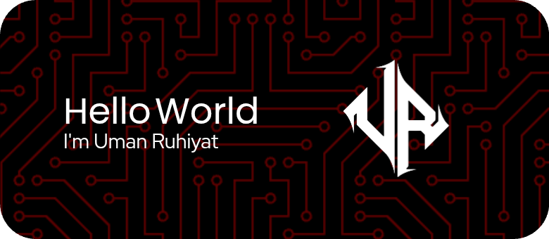

<!--
**umnrhyt/umnrhyt** is a ✨ _special_ ✨ repository because its `README.md` (this file) appears on your GitHub profile.

Here are some ideas to get you started:

- 🔭 I’m currently working on ...
- 🌱 I’m currently learning ...
- 👯 I’m looking to collaborate on ...
- 🤔 I’m looking for help with ...[doc.github.com](https://docs.github.com/en)
- 💬 Ask me about ...
- 📫 How to reach me: ...
- 😄 Pronouns: ...
- ⚡ Fun fact: ...
-->

# Hello World, I'am Uman Ruhiyat👋

###
<!--
<picture>
  <source media="(prefers-color-scheme: dark)" srcset="https://raw.githubusercontent.com/umnrhyt/umnrhyt/output/pacman-contribution-graph-dark.svg">
  <source media="(prefers-color-scheme: light)" srcset="https://raw.githubusercontent.com/umnrhyt/umnrhyt/output/pacman-contribution-graph.svg">
  
</picture>
-->
###

###
## 🚀 About Me
- 🎓 Saya sangat tertarik dengan pemrograman, belajar teknologi baru, dan memecahkan masalah.
- 💼 Saat ini saya sedang mengeksplorasi kontribusi open-source dan meningkatkan keterampilan pengembangan saya.
<!--🌱 Sedang mempelajari **[teknologi atau topik yang sedang dipelajari]**.
- 📫 Hubungi saya di: [LinkedIn](https://www.linkedin.com/in/umnrhyt).
-->

---
### Learning

---
## Connect With Me 

